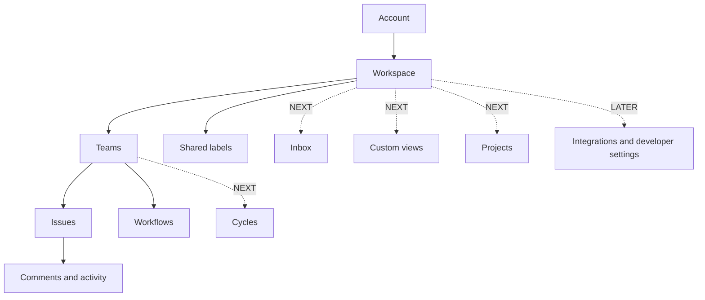

# 02 — Product map and information architecture

## Content hierarchy



An account may join multiple workspaces. A workspace is the tenant boundary. A team is the primary visibility and numbering boundary for issues. Workspace owners/admins have disclosed administrative access to every team; ordinary members see only explicitly joined teams.

## Navigation principles

1. The current workspace is always visible and switchable.
2. Global destinations precede team destinations; team sections never duplicate workspace-wide pages without a clear scope indicator.
3. Navigation contains only shipped features. Future-release items have no disabled rows or “coming soon” placeholders.
4. Breadcrumbs communicate workspace/team/object context and provide canonical navigation; browser history remains meaningful.
5. Search and create are global actions whose scope is explicit before submission.
6. Settings are separated by Account, Workspace, and Team ownership.
7. Permission filtering removes inaccessible destinations, while direct unauthorized URLs return a non-leaking 404 unless a signed-in user needs an explicit 403 to resolve an administrative problem.

## MVP navigation

```text
Workspace switcher
├── My issues
├── Search
├── Teams
│   └── <Team>
│       ├── Issues
│       └── Triage
└── Settings
    ├── Account
    │   ├── Profile
    │   ├── Security & sessions
    │   └── Appearance
    ├── Workspace
    │   ├── General
    │   ├── Members
    │   ├── Teams
    │   └── Labels
    └── Team
        ├── General
        ├── Members
        └── Workflow
```

`Triage` is a predefined issue collection based on the workflow’s Triage category, not a separate support or integration subsystem. `My issues` is a predefined assignee filter, not a separate data model.

## NEXT navigation additions

```text
Workspace
├── Inbox
├── Views
├── Projects
└── Teams
    └── <Team>
        ├── Views
        └── Cycles
```

Workspace Views may span authorized teams. Team Views are constrained to one team. Projects may span teams within the workspace. Cycles belong to exactly one team.

## LATER settings additions

```text
Workspace settings
├── Integrations
├── Templates
└── Developer
    ├── API tokens
    └── Webhooks
```

Integration health does not become primary navigation. Failures surface contextually to authorized admins and in the integration detail screen.

## Conceptual route map

Routes express resource context but do not grant access. Names are conceptual contracts; the router implementation may vary while preserving canonical URLs and deep-link behavior.

| Screen ID | Release | Canonical route | Scope |
| --- | --- | --- | --- |
| SCR-AUTH-SIGNIN | MVP | `/auth/sign-in` | Account |
| SCR-AUTH-VERIFY | MVP | `/auth/verify` | Account |
| SCR-INVITE | MVP | `/invites/:token` | Invitation |
| SCR-ONBOARD | MVP | `/onboarding` | Account/new workspace |
| SCR-MY-ISSUES | MVP | `/:workspace/my-issues` | Authorized teams in workspace |
| SCR-TEAM-ISSUES | MVP | `/:workspace/teams/:team/issues` | Team |
| SCR-TEAM-TRIAGE | MVP | `/:workspace/teams/:team/triage` | Team |
| SCR-ISSUE | MVP | `/:workspace/issues/:issueKey` | Issue/team |
| SCR-SEARCH | MVP | `/:workspace/search?q=` or modal state | Authorized workspace content |
| SCR-ACCOUNT | MVP | `/:workspace/settings/account/:section` | Current account |
| SCR-WORKSPACE-SETTINGS | MVP | `/:workspace/settings/workspace/:section` | Workspace |
| SCR-TEAM-SETTINGS | MVP | `/:workspace/settings/teams/:team/:section` | Team |
| SCR-INBOX | NEXT | `/:workspace/inbox` | Current member |
| SCR-VIEWS | NEXT | `/:workspace/views` | Workspace/authorized teams |
| SCR-VIEW | NEXT | `/:workspace/views/:viewId` | Saved view |
| SCR-PROJECTS | NEXT | `/:workspace/projects` | Workspace |
| SCR-PROJECT | NEXT | `/:workspace/projects/:projectId` | Project |
| SCR-CYCLES | NEXT | `/:workspace/teams/:team/cycles` | Team |
| SCR-CYCLE | NEXT | `/:workspace/teams/:team/cycles/:cycleId` | Team/cycle |
| SCR-INTEGRATIONS | LATER | `/:workspace/settings/integrations` | Workspace admin |
| SCR-INTEGRATION | LATER | `/:workspace/settings/integrations/:provider` | Workspace admin |
| SCR-TEMPLATES | LATER | `/:workspace/settings/templates` | Workspace/team manager |
| SCR-DEVELOPER | LATER | `/:workspace/settings/developer/:section` | Workspace admin or token owner |

Issue list and board layout are view modes on the same collection route, represented in durable URL/query state where sharing is useful. Creating an issue uses a modal/sheet over the current context, while the created issue always receives a canonical route.

## Scope and context behavior

| Context | Default create team | Search scope | Labels | Workflow |
| --- | --- | --- | --- | --- |
| Team issue/triage/cycle | Current team | Current team, expandable to workspace | Workspace labels available to team | Current team |
| My issues | Last used accessible team; user must confirm | All authorized teams | Based on selected team | Based on selected team |
| Workspace view/project | Explicit selection or saved default | All authorized teams represented | Workspace labels | Per issue’s team |
| Issue detail | Issue’s team | Related picker restricted to authorized workspace/team data | Workspace labels | Issue’s team |

## Desktop and responsive shells

- **≥ 1024px:** persistent or collapsible workspace/team sidebar, content pane, optional issue detail panel.
- **768–1023px:** collapsible overlay navigation; issue detail becomes full width by default; board scrolls horizontally with clear column landmarks.
- **< 768px:** navigation drawer, single content column, full-screen dialogs/sheets, list-first issue browsing, and non-drag controls for board movement.
- URL, selection, unsaved draft, and focus behavior must remain consistent when crossing breakpoints.

## Naming and identifiers

- Workspace has a unique URL slug within the deployment.
- Team has an uppercase human-readable identifier, used in immutable issue keys such as `ENG-42`.
- Renaming a team does not change existing issue keys. Changing a team identifier is either prohibited after first issue creation or handled by a separately approved alias/migration decision.
- Product copy uses **issue**, **team**, **workspace**, **status**, **label**, **project**, and **cycle** consistently. “Ticket,” “task,” and “sprint” appear only in imported/external content.

## IA acceptance criteria

- Every screen in [03 — Feature inventory](03-feature-inventory.md) has one canonical location or is explicitly modal/contextual.
- The MVP sidebar contains no NEXT/LATER destinations.
- A user can identify current workspace and team from every issue collection/detail screen.
- Switching workspace clears tenant-scoped client state before rendering the new workspace.
- Direct links restore the intended screen after authentication without bypassing authorization.
- All navigation is keyboard reachable, has visible focus, and exposes current/expanded state semantically.
