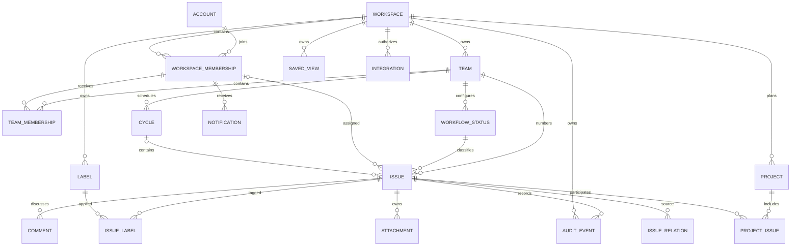

# 07 — Domain model and permission matrix

## Authorization model

Authorization is a domain capability, not controller middleware sprinkled across routes. HTTP, search, exports, background jobs, realtime, and integrations call the same policy layer.

### Human principals

| Scope | Role | Meaning |
| --- | --- | --- |
| Workspace | `OWNER` | Full tenant administration; at least one active Owner must remain |
| Workspace | `ADMIN` | Workspace/team/content administration except ownership transfer and final workspace deletion |
| Workspace | `MEMBER` | Access only to explicitly joined teams and self-service account functions |
| Team | `MANAGER` | Team settings, membership, workflow/labels, and team-content moderation |
| Team | `MEMBER` | Team issue/comment participation |

Workspace Owner/Admin has explicit, disclosed administrative access to all teams and acts as Team Manager. This simple baseline is an open privacy decision at OD-06; no implementation may accidentally create a different rule.

### Machine principals — LATER

- `INTEGRATION`: provider connection owned by one workspace with allowed team IDs and explicit scopes.
- `SERVICE_TOKEN`: workspace-owned automation identity with scopes, expiry, creator, and optional team grants.
- `PERSONAL_TOKEN`: acts as its user but cannot exceed current user/tenant/team permissions; it also has narrower token scopes.

Machine principals never inherit the installer/creator’s full authority after creation.

## Tenant derivation rules

1. The authenticated principal selects an accessible workspace context.
2. Server resolves `::WORKSPACE_ID::` from the object’s authoritative parent: team for issue/workflow/cycle, issue for comment/attachment/relation/notification context, workspace for project/view/integration.
3. If route/body `::WORKSPACE_ID::` disagrees with the resolved parent, return a non-leaking not-found/invalid-reference response and audit suspicious repetition.
4. Every query includes tenant and, where applicable, team predicates before returning fields, counts, existence, search rank, or events.
5. Cross-workspace foreign keys are forbidden by service invariants and database constraints wherever relationally expressible.
6. Cache keys always include principal/session authorization context and `::WORKSPACE_ID::`; membership changes invalidate relevant server/client caches.

## Domain map

NEXT/LATER entities are shown to make boundaries explicit, not to authorize early schema creation.

## Entity contracts

All mutable entities include opaque ID, `created_at`, `updated_at`, and integer/version token. Timestamps are UTC instants; calendar-only dates use a date type, not midnight UTC.

| Entity | Release | Ownership | Required fields and invariants |
| --- | --- | --- | --- |
| Account | MVP | Global deployment | normalized unique email/provider subject, display name, status; secrets live in auth boundary |
| Session | MVP | Account | hashed/opaque credential reference, created/last-used/expiry, client metadata; revocable |
| Workspace | MVP | Self | name, unique slug, lifecycle state; at least one active Owner |
| WorkspaceMembership | MVP | Workspace | account, workspace role, active/invited/suspended state; unique account+workspace |
| Invitation | MVP | Workspace | hashed opaque token, email policy, role, team grants, inviter, expiry, consumed/revoked time |
| Team | MVP | Workspace | name, unique identifier, lifecycle state; identifier immutable after numbering unless OD-07 defines aliases |
| TeamMembership | MVP | Workspace membership + team | team role; unique member+team; cannot cross workspace |
| WorkflowStatus | MVP | Team | name, semantic category, color token, position, lifecycle; team has at least one non-archived usable status |
| Label | MVP | Workspace | name, color token, lifecycle; unique normalized name per workspace unless later namespacing approved |
| Issue | MVP | Team → workspace | number/key, title, version, status, priority, optional assignee, description document, lifecycle; unique team+number |
| Comment | MVP | Issue → team/workspace | author, version, body document, optional parent for one-level replies, lifecycle |
| IssueLabel | MVP | Issue + label | both share workspace; unique pair |
| AuditEvent | MVP | Workspace | actor principal, action, object type/id, team where applicable, occurred time, request/correlation ID, safe before/after metadata; append-only |
| OutboxEvent | MVP | Workspace | event ID/type/version, aggregate/version, safe payload, delivery state; written with domain transaction |
| SavedView | NEXT | Workspace, optional team | creator, name, description, visibility, versioned query/presentation definition |
| ViewBookmark | NEXT | Membership + view | personal order/state; unique pair |
| IssueRelation | NEXT | Workspace, two authorized issues | type, source/target, creator; inverse derived; duplicate pair/type rules |
| Attachment | NEXT | Issue/comment → workspace | uploader, storage key, original safe name, size, media type, hash, scan/status; content never stored in event/log |
| Notification | NEXT | Recipient membership | type, actor/object reference, group key, created/read/muted state; target re-authorized on read |
| Project | NEXT | Workspace | name, summary, status, lead membership, participating team IDs, optional date-only range, lifecycle |
| ProjectIssue | NEXT | Project + issue | same workspace, issue team included in project team set; unique pair |
| Cycle | NEXT | Team | sequence/name, date-only range, state; active/upcoming overlap rules |
| Integration | LATER | Workspace | provider, integration principal, encrypted credential reference, allowed teams/scopes, installer, lifecycle/health |
| Template | LATER | Workspace + team | issue-only versioned defaults, creator, lifecycle; references validated on apply |
| ApiCredential | LATER | Account or workspace | hashed token, prefix, scopes, team grants, expiry/revoked/last-used; secret shown once |
| WebhookSubscription | LATER | Workspace | verified HTTPS URL, event/team scopes, encrypted signing secret, status, delivery policy |

## Core field invariants

- Issue `assignee_id` is null or an active workspace member with access to the issue team.
- Issue `status_id` belongs to its team and is not archived for new assignments.
- Every issue label belongs to the issue workspace.
- A comment parent belongs to the same issue; replies do not nest beyond one visible level.
- Moving an issue allocates a new target-team key unless OD-07 chooses aliases; activity retains the old key. It never changes `::WORKSPACE_ID::`.
- NEXT relation endpoints share a workspace and are individually visible to the actor.
- NEXT attachment download rechecks parent issue read permission; possession of an object-storage URL is insufficient.
- NEXT project membership never grants team/issue access.
- NEXT cycle and issue share a team; an issue is in zero or one cycle.

## Permission matrix — identity and organization

Legend: **Own** = current account/resource creator relationship; **TM** = Team Manager; **M** = Team Member; **WA** = Workspace Admin; **WO** = Workspace Owner; **IP** = scoped integration principal.

| Operation | WO | WA | Workspace Member / TM / M | Machine | Audit |
| --- | --- | --- | --- | --- | --- |
| View/update own profile | Own | Own | Own | No | Security changes only |
| List/revoke own sessions | Own | Own | Own | No | Yes |
| View workspace metadata | Yes | Yes | Active member | Scoped token only | No |
| Update workspace name/icon | Yes | Yes | No | No | Yes |
| Transfer ownership | Yes | No | No | No | Yes, high severity |
| Delete workspace | Yes, reauth + policy | No | No | No | Yes + lifecycle job |
| Create invite | Yes | Yes | No | No | Yes |
| Revoke invite | Yes | Yes | No | No | Yes |
| Accept invite | Valid invitee | Valid invitee | Valid invitee | No | Yes |
| List members | Yes | Yes | Limited directory per policy | Scoped `members:read` fields | Sensitive access not per-view |
| Change workspace role | Yes; preserve Owner invariant | Member↔Admin only, not Owner | No | No | Yes |
| Suspend/reactivate/remove member | Yes | Yes except Owner | No | No | Yes, revoke sessions |
| Create team | Yes | Yes | No | No | Yes |
| View team metadata/content | Yes | Yes | Explicit team member | Explicit team grant + scope | No ordinary read audit |
| Update/archive team | Yes | Yes | TM for update; archive WA/WO | No | Yes |
| Manage team membership | Yes | Yes | TM may add/remove active workspace Members, not elevate workspace role | No | Yes |

## Permission matrix — workflows, labels, issues, and comments

| Operation | WO/WA | TM | M | Workspace member outside team | IP/token | Audit/activity |
| --- | --- | --- | --- | --- | --- | --- |
| View workflow/labels | Yes | Yes | Yes | Labels metadata only if workspace policy allows; no team workflow | Scoped read | No |
| Create/update/reorder/archive status | Yes | Yes | No | No | No | Audit; impacted issue migration |
| Create/update/archive label | Yes | No; labels are workspace-shared | No | No | Scoped `labels:write` only if later approved | Audit |
| List/read/search issue | Yes | Yes | Yes | No | `issues:read` + team grant | No ordinary read; suspicious denial telemetry |
| Create issue | Yes | Yes | Yes | No | `issues:write` + team grant | Activity + audit summary |
| Edit title/description/status/priority/assignee/labels | Yes | Yes | Yes | No | Per-field write scope + team grant | Activity |
| Move issue to another team | Yes | Both source and target team management | No | No | No default scope | Audit + activity |
| Archive/restore issue | Yes | Yes | Creator for own issue if workspace policy enables; otherwise No | No | Explicit scope only | Audit + activity |
| Hard-delete issue | Retention job authorized by WO policy | No | No | No | No | High-severity audit |
| Create comment/reply | Yes | Yes | Yes | No | `comments:write` + issue read | Activity |
| Edit/delete comment | Moderator or own | Moderator or own | Own only | No | Own machine-authored comment if scoped | Activity; moderation audit |
| Moderate another author’s comment | Yes | Yes | No | No | No | Yes |
| Read issue activity | Yes | Yes | Yes | No | `issues:read` excluding restricted audit fields | No |
| View security audit | Yes | Yes, except Owner/security-secret fields may be restricted | No | No | No | Audit access may itself be logged |

Assignment is not permission delegation. Mentioning or linking a user does not grant issue access.

## Permission matrix — NEXT collaboration and planning

| Operation | WO/WA | TM | M | Outside team | Notes |
| --- | --- | --- | --- | --- | --- |
| Create saved team view | Yes | Yes | Yes | No | Definition can reference only accessible fields/objects |
| Edit/delete saved view | Yes | Team-scoped manager or creator | Creator | No | Sharing never grants content access |
| Bookmark view | Own | Own | Own | Only if can view | Personal state |
| Create/delete relation | Yes | Yes | Yes if both issues visible | No | Duplicate/close semantics may restrict type |
| Upload attachment | Yes | Yes | Yes | No | Quota/type/scan policy |
| Delete attachment | Yes | Yes | Uploader | No | Parent authorization + audit |
| Watch/mute issue | Own | Own | Own | No | Only own participation state |
| Read/update notification | Recipient | Recipient | Recipient | No | Target re-authorized; admins cannot read another Inbox by role |
| Create project | Yes | If manages every selected team | Member only if made project lead by policy | No | OD may broaden after research |
| View project | Yes | Yes when at least one participating team accessible | Only visible issue/team subset with limited-access marker | No | Project membership grants no issue access |
| Update/archive project | Yes | Project lead or manager of participating teams | Project lead | No | Team changes validate issue links |
| Add/remove project issue | Yes | Project lead/TM with issue access | Project lead or team M if project policy permits | No | Unlink, never delete |
| Create/update/start/close cycle | Yes | Yes | No | No | One team; rollover confirmation |
| Add/remove cycle issue | Yes | Yes | Yes | No | Issue and cycle same team |

## Permission matrix — LATER integrations and developer operations

| Operation | WO | WA | Member/TM | Integration/token | Audit |
| --- | --- | --- | --- | --- | --- |
| Install/configure/uninstall provider | Yes | Yes | No | No self-elevation | Yes |
| Select integration team grants/scopes | Yes | Yes | No | No | Yes |
| View credential secret | Never after initial exchange | Never | Never | Provider use through secret service only | Secret access metadata only |
| View health/delivery logs | Yes | Yes | No unless delegated future role | Own delivery ID only through internal worker | Sensitive log access may be audited |
| Create/revoke personal token | Own | Own | Own | No | Yes |
| Create/revoke service token | Yes | Yes if scope ≤ own authority and no Owner scope | No | No | Yes |
| Create/configure/delete webhook | Yes | Yes | No | No | Yes |
| Create/update template | Yes | Yes | TM for own team | No | Yes |
| Apply template | Yes | Yes | Team M | `issues:write` may supply equivalent fields without template access | Issue create audit only |

## Integration field-access contract — LATER

Field access is allowlisted by provider capability and selected scopes.

| Scope | Read | Write | Never included |
| --- | --- | --- | --- |
| `issues:read` | issue key, title, sanitized description if explicitly approved, status, priority, assignee display identity, labels, timestamps, permitted external links | None | private audit metadata, sessions, member email by default, attachment bytes |
| `issues:write` | Required reference metadata | create/update allowlisted issue fields in granted teams | workspace/team role changes, hard delete, arbitrary source metadata |
| `comments:read` | sanitized comments on permitted issues | None | deleted bodies, moderation/security audit |
| `comments:write` | target issue and own prior comment IDs | create/update/delete integration-authored comments | impersonating a human author |
| `members:read` | stable workspace-member ID, display name/avatar, team membership only as needed | None | email unless separate justified scope, role/security/session data |
| `projects:read` | project metadata and permitted issue references | None | hidden-team totals/content |
| `events:read` | versioned events for granted resources/teams | None | secrets, raw auth/provider tokens, unrestricted before/after blobs |

GitHub starts with link/reference fields. Bidirectional issue/comment sync needs separate explicit scopes and contract revision. Slack starts with selected notification/intake fields; full thread mirroring is not a default capability.

## Export contract

| Export | Who | Included | Excluded/redacted | Behavior |
| --- | --- | --- | --- | --- |
| Own account data | Current account | profile, memberships, own authored content references, sessions metadata | secrets/token hashes, other users’ private data | Authenticated request; documented legal/privacy handling |
| Workspace data | WO; WA only if policy grants | active/archived tenant domain data and safe audit metadata | authentication secrets, provider tokens, token hashes, internal security signals | LATER async job, encrypted temporary artifact, expiring single-use download, audit |
| Team/issues CSV | LATER policy: WA/WO or TM for team | selected authorized issue fields | comments/attachments unless explicitly requested; formulas neutralized | Bounded filters, timezone/encoding declared, audit |

An export worker re-evaluates requester authority before generation and before download. Export URLs are short-lived and bound to requester.

## Deletion and retention contract

| Object | User-visible action | Immediate effect | Final deletion |
| --- | --- | --- | --- |
| Issue/project/team | Archive | Removed from default views; references/history retained | After policy window and dependency checks; hard-delete privileged job |
| Comment | Delete | Tombstone preserves thread/activity attribution; body hidden | Policy-driven purge while retaining non-content audit marker |
| Attachment | Delete | Download denied; storage object queued for deletion | Worker verifies deletion and records non-content audit |
| Member | Remove | Access revoked; authored content attributed to retained identity/tombstone | Personal data handling follows policy/legal decision |
| Integration/token/webhook | Revoke/delete | Credentials unusable immediately; deliveries stop | Secret material deleted/rotated; bounded logs retained |
| Workspace | Delete request | Freeze or scheduled-deletion state after reauthentication/confirmation | Backup/export option, retention window, cascading verified job, irrecoverable completion audit outside deleted tenant where legally safe |

Exact retention periods are OD-08. UI must never promise immediate physical erasure when backups or bounded recovery retain data.

## Audit taxonomy

Always audit: workspace/team lifecycle; ownership/role/team-membership changes; invite lifecycle; suspension/removal; workflow/label destructive changes; issue create/move/archive/restore/hard-delete; comment moderation; export/deletion; integration/token/webhook lifecycle; credential rotation; cycle close/rollover.

Audit records contain actor principal type/ID, `::WORKSPACE_ID::`, optional team, action, object type/ID, safe changed-field names and before/after identifiers, timestamp, request/correlation ID, and source IP/user-agent only under a documented retention/privacy policy. Never include session credentials, provider tokens, webhook secrets, raw attachment bytes, or full rich-text bodies in administrative audit.

## Authorization acceptance

- Cross-workspace tests cover every operation in these matrices, including count, search, export, background, and realtime paths.
- Team removal blocks reads/mutations/events immediately enough to meet the session/revocation SLA.
- IDs from another tenant return non-leaking responses and cannot alter timing/counts meaningfully.
- Owner/Admin/Manager hierarchy constraints are property-tested for escalation paths.
- Integration scopes are tested as a second boundary in addition to user/tenant/team access.
- Policy decisions are centralized, named, and callable from HTTP, jobs, events, and integrations.
