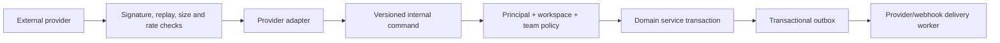

# 08 — API, events, realtime, jobs, and integration boundaries

## Boundary principles

1. The service layer owns domain invariants and authorization; transports adapt inputs and outputs.
2. Internal HTTP APIs are not a public compatibility promise. The public API/SDK begins only in LATER.
3. Domain transactions commit before user-visible success. Side effects originate from a transactional outbox.
4. Realtime delivers hints/versioned events, not authority. Clients refetch authorized state after gaps or ambiguity.
5. Background and integration workers act as explicit principals with tenant/team scopes.
6. Provider/webhook failure cannot roll back an already committed core issue mutation.

## Request identity and tenancy

Every request context contains:

- principal type and ID;
- authenticated account/session or machine credential;
- selected accessible `::WORKSPACE_ID::`;
- request/correlation ID;
- locale/timezone preferences for presentation only;
- verified integration scopes/team grants where applicable.

Route parameters locate resources but never establish ownership. Services use tenant-scoped repositories such as `getIssueForPrincipal(principal, workspaceId, issueId, capability)` and do not expose unscoped `findById` to controllers/workers.

## HTTP conventions

| Concern | Contract |
| --- | --- |
| Resource IDs | Opaque UUID/ULID-style IDs; issue key is a human lookup alias, not primary key |
| JSON | UTF-8, explicit date/date-time formats, camelCase or snake_case chosen once before implementation |
| Mutation concurrency | Integer `version` or ETag; `If-Match`/expected version required for authored-content replacement and destructive changes |
| Idempotency | `Idempotency-Key` required for create, invite acceptance, cycle close/rollover, export, and externally retried commands |
| Pagination | Cursor-based with bounded `limit`; cursor binds query/sort/workspace and is opaque/signed |
| Filtering | Versioned structured allowlist; unknown fields/operators fail clearly, never become raw SQL |
| Sorting | Stable allowlisted sort plus ID tie-breaker |
| Partial updates | Explicit patch DTO; omitted differs from null; field-level policy/invariants run after merge |
| Errors | Stable machine code, safe message, field errors, correlation ID; no stack/SQL/provider secret |
| Rate limits | Per IP for public auth, per account/session/workspace for app, per credential/provider for APIs/integrations |
| Content | Rich text validated/sanitized on write and rendered defensively; payload/body limits at edge and service |

Conceptual error envelope:

```json
{
  "error": {
    "code": "ISSUE_VERSION_CONFLICT",
    "message": "The issue changed before your update was saved.",
    "fields": {},
    "correlationId": "req_opaque"
  }
}
```

`401` means no valid principal, `403` is used when revealing a known container and missing capability helps a signed-in user resolve access, `404` hides object existence across tenant/team boundaries, `409` covers version/invariant conflict, `422` covers field validation, and `429` includes safe retry guidance.

## Resource contracts by release

These are capability endpoints, not a fixed framework/router prescription.

### MVP internal API

| Resource | Reads | Commands |
| --- | --- | --- |
| Session/account | current profile, sessions, accessible workspaces | sign in/verify/logout, update profile, revoke session |
| Workspace | current metadata, memberships, teams, labels | create/update, invite/revoke, role/team access, suspend/reactivate/remove, label mutations |
| Team | metadata, members, workflow | create/update/archive, membership, workflow mutations |
| Issue | list/get by ID or key, activity | create/patch/archive/restore, permitted inline field commands |
| Comment | list by issue | create/patch/delete/reply |
| Search | authorized issue search | none |
| Preferences | current user/context display settings | upsert preference |
| Operations | health/readiness/version for operator | no public admin mutation |

### NEXT internal API

| Resource | Reads | Commands |
| --- | --- | --- |
| Saved view/bookmark | list/get/run | create/update/delete/bookmark |
| Relation | list by issue | create/delete/resolve duplicate behavior |
| Attachment | metadata/download authorization | initiate/complete/delete upload |
| Notification | recipient list/count | mark read/unread, mute, clear |
| Project | list/get/issues/progress | create/update/archive, link/unlink issue |
| Cycle | list/get/issues/progress | create/update/start/close/rollover, add/remove issue |
| Realtime | authorized stream ticket/connection | subscribe to server-selected workspace/member/team topics |

### LATER public API and integration API

Public resources are a deliberately smaller projection of internal domain capabilities. They require version prefix/media contract, published lifecycle/deprecation, pagination, rate limits, idempotency, scoped credentials, changelog, and conformance tests. Internal DTOs/database rows are never exposed wholesale.

## Query contract

MVP issue collection query contains:

- context: one workspace and optional team;
- predefined mode: all, my, or triage;
- filters: status IDs/categories, assignee IDs/me/unassigned, priorities, label IDs, team IDs where allowed;
- layout: list or board;
- grouping: status, assignee, priority, label where meaningful;
- order: priority, created, updated with stable tie-break;
- completed visibility;
- cursor/limit.

The service intersects requested teams/references with principal access before counting or fetching. It rejects a saved/requested filter referencing an object outside the principal’s workspace rather than silently turning it into an existence oracle.

## Domain event envelope

Outbox events are immutable, versioned, minimal, and safe for their declared audience.

```json
{
  "eventId": "evt_opaque",
  "type": "issue.status_changed",
  "schemaVersion": 1,
  "occurredAt": "2026-08-03T12:00:00Z",
  "workspaceId": "ws_opaque",
  "teamId": "team_opaque",
  "aggregate": { "type": "issue", "id": "issue_opaque", "version": 7 },
  "actor": { "type": "user", "id": "member_opaque" },
  "data": { "fromStatusId": "status_a", "toStatusId": "status_b" },
  "correlationId": "req_opaque"
}
```

Internal events may contain opaque IDs needed by workers. Realtime/public webhook projections are separately allowlisted and re-authorized; they do not receive raw internal events automatically.

## Event catalog

| Release | Event families | Consumers |
| --- | --- | --- |
| MVP | workspace/member/team/workflow/label lifecycle; issue created/updated/status/assignment/labels/archived; comment created/updated/deleted | audit projector, activity, essential internal jobs/cache invalidation |
| NEXT | relation, attachment status, watcher, notification, view, project, cycle/rollover | Inbox projector, authorized realtime projection, file worker, progress invalidation |
| LATER | integration lifecycle, provider delivery, token/webhook lifecycle; approved domain webhook projections | connector workers, outbound webhook dispatcher, developer logs |

Events are not event-sourcing. Current state remains in normalized domain tables; outbox retention/replay is bounded and documented.

## Realtime contract — NEXT

MVP uses ordinary request/response plus refetch on focus/mutation. NEXT may use Server-Sent Events first because delivery is server→client and simpler to operate; WebSocket requires a demonstrated bidirectional need.

- Connection authenticates with the normal session; no token in URL logs.
- Server derives workspace/member and allowed team channels. Client may request a narrower view, never arbitrary room names.
- Each message includes event ID, resource/version, safe change kind, and invalidation hint—not unrestricted object snapshots.
- Client tracks last event ID, reconnects with bounded backoff/jitter, and performs authorized refetch after retention gap, membership change, version gap, or unknown event.
- Membership suspension/removal closes or deauthorizes existing connections promptly.
- Heartbeats contain no tenant data. Per-principal connection and delivery limits prevent abuse.
- Multi-instance fan-out must use a documented broker or PostgreSQL notification mechanism only when deployment topology requires it; it is not an MVP dependency.

## Background jobs

### MVP

- auth/invite email delivery when email auth is enabled;
- outbox dispatch and retry;
- session/invite expiry cleanup;
- archive/retention cleanup under policy;
- operational maintenance explicitly required for correctness.

Start with an in-process worker using a PostgreSQL-backed outbox/lease table and separate worker process mode if needed. Jobs have unique key/idempotency key, workspace/principal context, attempt count, next attempt, bounded exponential backoff with jitter, terminal state, safe error code, and correlation ID. Handlers are idempotent and use leases/timeouts to recover from worker death.

### NEXT

- attachment finalize/scan/delete;
- notification projection/grouping;
- project/cycle progress invalidation if not computed synchronously;
- optional realtime fan-out support.

### LATER

- integration inbound processing;
- outbound webhook dispatch/retry;
- export generation/deletion;
- credential/provider health checks.

A queue service/Redis/external scheduler is introduced only when PostgreSQL-backed processing cannot meet measured throughput/availability. Operational UI never exposes a public unauthenticated job-status endpoint.

## Attachment boundary — NEXT

1. Authorized client requests upload intent with filename, claimed media type, and size.
2. Server checks team/issue access and quota, returns randomized short-lived storage upload authorization.
3. Client uploads directly where supported.
4. Completion command verifies storage metadata/hash/size, marks Pending Scan or Uploaded according to operator policy.
5. Download request rechecks issue access and returns a short-lived disposition-safe URL or streams through service.
6. Delete denies future download immediately and queues physical object deletion.

Never trust extension/media type, reuse user filename as storage key, serve active content inline by default, or place permanent public URLs in issue records.

## Integration boundary — LATER



- OAuth state binds provider, installer, `::WORKSPACE_ID::`, allowed redirect, expiry, nonce, and PKCE when supported.
- Credentials are encrypted through a key-management abstraction, redacted everywhere, rotatable, and only released to the specific provider adapter for a scoped call.
- Inbound webhook verifies provider signature, timestamp/replay, content type, size, and rate before parsing deeply.
- Provider object IDs map through dedicated tables with workspace/provider uniqueness; generic unvalidated JSON cannot become authorization state.
- Outbound HTTP blocks loopback, link-local, private, metadata, and resolved/rebound forbidden addresses; requires HTTPS except explicit local-development mode; limits redirects, response size, and time.
- Provider adapters cannot import arbitrary remote code. They are reviewed deploy-time modules or isolated external services using the public contract.

## Outbound webhooks — LATER

- Event/team selection is explicit and constrained by creator authority.
- Endpoint ownership is verified before activation.
- Payload has public schema version, delivery/event ID, occurred time, resource projection, and no fields outside subscription scopes.
- HMAC signature includes timestamp and raw body; receiver replay window is documented; secrets rotate with overlap.
- Deliveries are at-least-once, ordered only per aggregate if promised, and retried with bounded backoff. Consumers use delivery/event ID for idempotency.
- Delivery log records status class, duration, attempts, safe error, and bounded/redacted response—not credentials or unbounded bodies.
- Repeated terminal failure disables or pauses the subscription with admin-visible notice.

## Technical acceptance

- Contract tests exercise authorization for every resource/action and every principal type.
- Schema/DTO validation rejects extra privilege-bearing fields.
- Idempotency and optimistic concurrency tests cover retry/race behavior.
- Outbox commit/dispatch/retry survives process termination without losing or duplicating non-idempotent effects.
- Realtime and webhook projections contain only declared fields and stop after access revocation.
- Provider/egress tests cover signature failure, replay, DNS rebinding/private targets, redirects, timeouts, rate limits, and secret redaction.
- Backup/restore and rolling/single-instance upgrade behavior account for pending outbox jobs and schema compatibility.
