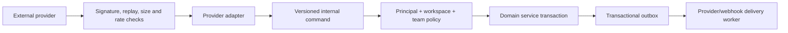

# 08 — API, events, realtime, jobs, and integration boundaries

## Boundary principles

1. The service layer owns domain invariants and authorization; transports adapt inputs and outputs.
2. Internal HTTP APIs are not a public compatibility promise. The public API/SDK begins only in LATER.
3. Domain transactions commit before user-visible success. Side effects originate from a transactional outbox.
4. Realtime delivers hints/versioned events, not authority. Clients refetch authorized state after gaps or ambiguity.
5. Background and integration workers act as explicit principals with tenant/team scopes.
6. Provider/webhook failure cannot roll back an already committed core issue mutation.

## Request identity and tenancy

Every request context contains:

- principal type and ID;
- authenticated account/session or machine credential;
- selected accessible `::WORKSPACE_ID::`;
- request/correlation ID;
- locale/timezone preferences for presentation only;
- verified integration scopes/team grants where applicable.

Route parameters locate resources but never establish ownership. Services use tenant-scoped repositories such as `getIssueForPrincipal(principal, workspaceId, issueId, capability)` and do not expose unscoped `findById` to controllers/workers.

## HTTP conventions

| Concern | Contract |
| --- | --- |
| Resource IDs | Opaque UUID/ULID-style IDs; issue key is a human lookup alias, not primary key |
| JSON | UTF-8, explicit date/date-time formats, camelCase or snake_case chosen once before implementation |
| Mutation concurrency | Integer `version` or ETag; `If-Match`/expected version required for authored-content replacement and destructive changes |
| Idempotency | `Idempotency-Key` required for create, invite acceptance, cycle close/rollover, export, and externally retried commands |
| Pagination | Cursor-based with bounded `limit`; cursor binds query/sort/workspace and is opaque/signed |
| Filtering | Versioned structured allowlist; unknown fields/operators fail clearly, never become raw SQL |
| Sorting | Stable allowlisted sort plus ID tie-breaker |
| Partial updates | Explicit patch DTO; omitted differs from null; field-level policy/invariants run after merge |
| Errors | Stable machine code, safe message, field errors, correlation ID; no stack/SQL/provider secret |
| Rate limits | Per IP for public auth, per account/session/workspace for app, per credential/provider for APIs/integrations |
| Content | Rich text validated/sanitized on write and rendered defensively; payload/body limits at edge and service |

Conceptual error envelope:

```json
{
  "error": {
    "code": "ISSUE_VERSION_CONFLICT",
    "message": "The issue changed before your update was saved.",
    "fields": {},
    "correlationId": "req_opaque"
  }
}
```

`401` means no valid principal, `403` is used when revealing a known container and missing capability helps a signed-in user resolve access, `404` hides object existence across tenant/team boundaries, `409` covers version/invariant conflict, `422` covers field validation, and `429` includes safe retry guidance.

## As built (v1 server)

The conventions above are the target; these are the contracts the Go server implements today. Where they differ from the table, this section describes the running system.

**Issue write concurrency.** Every Issue payload carries an integer `version`, bumped by every mutation. The four issue writes — `POST /api/v1/issues/{id}` (update), `POST /api/v1/issues/{id}/move`, `DELETE /api/v1/issues/{id}`, and `POST /api/v1/issues/{id}/handoff` — honour `If-Match: "<version>"` (bare, quoted, and `W/` forms accepted). The issue row is locked and compared inside the write's transaction:

| Case | Response |
| --- | --- |
| API-token (agent) principal without `If-Match` | `428`; agents must always send it |
| `If-Match` not an integer version | `400` |
| Version differs from the locked row | `412` with `{"error", "version": <current>}` and `ETag: "<current>"`; re-read and decide again |
| Version matches, or a human session without `If-Match` | the write proceeds; the response carries `ETag: "<new version>"` |

`412` (not `409`) is used because the failure is the request's own precondition. The web client does not send versions yet, so human edits stay last-writer-wins until it does; `converge_issue_precondition_failures_total{reason="missing"|"stale"}` counts refusals.

**Cross-site requests.** An unsafe request (`POST`/`PUT`/`PATCH`/`DELETE`) without an `Authorization` header gets `403 CROSS_ORIGIN` when its `Origin` — or, when a privacy setting strips it, its `Referer` — is anything but `CONVERGE_WEB_ORIGIN` or `CONVERGE_PUBLIC_URL`, with or without cookies (a cookie-less cross-site form could otherwise redeem an attacker's sign-in code in the victim's browser, or make the API mail links), and when it carries session cookies but neither header. Browsers send `Origin` automatically; a non-browser client that authenticates with cookies must send it itself. Bearer-token clients, and clients that send neither cookies nor `Origin`, are unaffected. The consume endpoint reads the code from the body only, never the query string.

**Sessions.** Sign-in creates a `sessions` row. Tokens name it (`sid`); access tokens are stateless and short-lived, refresh tokens are single-use:

- `POST /api/auth/session/refresh` rotates the refresh token (the old one stops working). The cookie flow also requires the `anti-csrf` header; the Bearer flow does not. Refresh no longer accepts an access token.
- Presenting the refresh token that was just replaced within 30 s (concurrent tabs) returns fresh access material without rotating again. Presenting any older one is treated as theft: the session is revoked (`revoked_reason = 'reuse'`), the response is `401`, and cookies are cleared.
- `POST /api/auth/signout` revokes the session row. Access tokens of a revoked session are refused by the instance that saw the revocation; after a restart, or on another instance, they remain valid until they expire (`CONVERGE_ACCESS_TOKEN_TTL`, default 1 h).
- Tokens minted before the session-row change carry no `sid` and are refused: every user signs in once after that upgrade.

**Auth rate limits.** `/api/auth/*` is limited per client IP (burst 30, then one request per 2 s) and code issuance per email address (5 codes, then one per 3 min). Excess requests get `429 RATE_LIMITED` with `Retry-After`. The client IP is the rightmost `X-Forwarded-For` hop not in `CONVERGE_TRUSTED_PROXIES`. The former `email/exists` probe endpoint is removed.

**Comments and relations.** Editing or deleting a comment requires its author or a workspace owner/admin; deleting a relation requires its creator or an owner/admin.

**Notifications.** Notification records are addressed: the SSE stream and the delta feed deliver each one only to its recipient.

**Realtime delivery.** Sync sequences are gap-free per workspace and commit in order. The SSE stream carries every committed sequence (another member's notification arrives as `{"sequenceId","skip":true}`), and every 15 s it sends `event: head` with `{"sequenceId":"<committed head>"}`. The client buffers out-of-order records and runs a delta when a hole outlasts 1.5 s; a head beyond its cursor counts as a hole, so a lost final record is repaired within one heartbeat instead of at the next write. A subscriber 64 events behind is disconnected and resyncs from the delta on reconnect. `sync-soak.test.ts` (client, seeded fault injection) and `outbox_db_test.go` (server, concurrent writers and rollbacks) pin these properties.

**Scoped agent tokens.** An agent token may carry scopes and team grants (migration 0021: `api_tokens.scopes`, `api_tokens.team_ids`). A token with neither, including every token issued before 0021, acts with the agent's full authority. A token with either is *narrowed*: before any handler runs, the route is looked up in `tokenRoutePolicy` (`server/internal/api/token_scope.go`), which names every `/api/v1` route. A route that is absent or maps to no scope gets `403 {"error":"this token may not call this endpoint"}`, so a new endpoint stays closed to narrowed tokens until someone adds it (a test walks the router and fails on any unlisted route). A missing scope gets `403 {"error":"this token's scopes do not allow this request","requiredScope":"<scope>"}`.

| Scope | Routes |
| --- | --- |
| `issues:read` | issue relations; teams, workflows, labels, projects, search |
| `issues:write` | issue create, update, move, handoff, subscribe; relation delete |
| `comments:read` / `comments:write` | list / create, update, delete, reply |
| `work` | the work API below |
| `sync:read` | bootstrap, delta, stream |
| (any narrowed token) | `GET /users` (who am I) |
| (never) | `DELETE /issues/{id}`, workspace/team/workflow/label/view/member/agent administration |

Team grants are checked where team access is decided, so every issue and comment route inherits them: a team outside the grant, or one the agent has left, answers `404` like any unreachable team, and `parentId`/relation targets must also be reachable. Routes whose data spans the workspace (sync, search, team/workflow/label/project metadata, relation delete) refuse a team-limited token with `403`; `sync:read` cannot be combined with `teamIds`.

**Agent administration.** Owner/admin only.

- `POST /workspaces/{id}/agents` takes `{name, teamIds?, driver?, token?: {scopes?, teamIds?, ttlHours?}}`.
- `POST /workspaces/{id}/agents/{accountId}` takes `{driver}`.
- `POST …/agents/{accountId}/token` (rotate) takes `{name?, scopes?, teamIds?, ttlHours?}` and answers `400` on a malformed body.
- Token validation: an empty `scopes` or `teamIds` list is refused (omit the field for full access), unknown scopes are refused, token teams must be teams the agent belongs to, and `ttlHours` must be 1–87600.
- `GET …/agents` lists each agent's `driver` and its live `tokens` (`id, name, scopes, teamIds, expiresAt, lastUsedAt, createdAt`; never the secret).

**Drivers.** `accounts.agent_driver` is `runtime` (default: the in-process swarm works the agent's issues) or `external` (an outside process works them through the work API, and the runtime never schedules, wakes, or counts that agent). Switching an agent back to `runtime` ends its open claims (`revoked`).

**Work API (external agents).** All four routes need an agent principal with the `external` driver (others get `403`) and, for a narrowed token, the `work` scope.

| Route | Contract |
| --- | --- |
| `GET /agent/queue` | `{workspaceId, assigned, available, claims}`: open issues assigned to the agent (not paused, not in Human Review, not completed/canceled; at most 100), unassigned issues in an `UNSTARTED` state of its teams with no live claim (by priority; at most 50), and its open claims. Team grants filter both lists. |
| `POST /issues/{id}/claim` `{ttlSeconds?}` | TTL 30–900 s (default 300; `422` otherwise). The issue must be assigned to the agent, or unassigned in an `UNSTARTED` state of one of its teams (claiming it assigns it). `409` if closed, waiting for a human, not the agent's, or held by another agent's live claim (`{"error","claimedById"}`). A claim the agent already holds is superseded. `200 {claim, packet}` with `ETag: "<version>"`. |
| `POST /issues/{id}/claim/heartbeat` `{claimId}` | Extends the lease by its TTL. `409 {"error":"the claim has ended","endReason"}` if it has ended or no longer holds (the heartbeat ends it). |
| `POST /issues/{id}/claim/release` `{claimId}` | Ends the claim; `200 {released:true}`, or `200 {released:false, endReason}` if it had already ended. Release does not unassign. |

A claim that is missing, belongs to another agent, or names another issue answers `404 "claim not found"`. `claim` is `{id, issueId, agentId, mode: "assigned"|"pool", claimedAt, expiresAt, ttlSeconds, heartbeatIntervalSeconds}`. The agent heartbeats every `heartbeatIntervalSeconds` (a third of the TTL, at least 10). The `packet` bundles what the agent needs to start without further reads: the issue, its description as plain text, team, the team's states, labels, the last 20 comments (oldest first), and the latest handoff to it.

A claim ends as `released`, `expired`, `superseded`, `reassigned`, `paused` (paused or parked in Human Review), `closed`, or `revoked` (agent suspended, driver changed, membership ended). A sweeper ends lapsed and invalidated claims every 10 s, even when the runtime is disabled. At most one claim per issue is open (a partial unique index, under the team advisory lock and a row lock). Opening or ending a claim bumps the issue `version` and emits an Issue update; heartbeats do neither. Holding a claim is not required to write an issue. The claim coordinates who works it, and a process whose claim ended is fenced by the version: its next `If-Match` write gets `412`.

**Claim on the wire.** Every Issue payload (bootstrap, delta, stream, responses) carries `claimedById` and `claimedAt`, the open claim's agent and start time, and explicit `null`s when there is none. The board shows a "claimed" chip on a card an external agent holds.

## Resource contracts by release

These are capability endpoints, not a fixed framework/router prescription.

### MVP internal API

| Resource | Reads | Commands |
| --- | --- | --- |
| Session/account | current profile, sessions, accessible workspaces | sign in/verify/logout, update profile, revoke session |
| Workspace | current metadata, memberships, teams, labels | create/update, invite/revoke, role/team access, suspend/reactivate/remove, label mutations |
| Team | metadata, members, workflow | create/update/archive, membership, workflow mutations |
| Issue | list/get by ID or key, activity | create/patch/archive/restore, permitted inline field commands |
| Comment | list by issue | create/patch/delete/reply |
| Search | authorized issue search | none |
| Preferences | current user/context display settings | upsert preference |
| Operations | health/readiness/version for operator | no public admin mutation |

### NEXT internal API

| Resource | Reads | Commands |
| --- | --- | --- |
| Saved view/bookmark | list/get/run | create/update/delete/bookmark |
| Relation (shipped v1.1 — spec `api:relations`) | reader's-side list by issue | create rides the issue update (`issueRelation` field); soft delete (`DELETE /issue_relation/{id}`, creator or owner/admin); guards: self, duplicate edge (409), blocks cycle (409, 64-hop walk) |
| Attachment | metadata/download authorization | initiate/complete/delete upload |
| Notification | recipient list/count | mark read/unread, mute, clear |
| Project | list/get/issues/progress | create/update/archive, link/unlink issue |
| Cycle | list/get/issues/progress | create/update/start/close/rollover, add/remove issue |
| Realtime | authorized stream ticket/connection | subscribe to server-selected workspace/member/team topics |

### LATER public API and integration API

Public resources are a deliberately smaller projection of internal domain capabilities. They require version prefix/media contract, published lifecycle/deprecation, pagination, rate limits, idempotency, scoped credentials, changelog, and conformance tests. Internal DTOs/database rows are never exposed wholesale.

## Query contract

MVP issue collection query contains:

- context: one workspace and optional team;
- predefined mode: all, my, or triage;
- filters: status IDs/categories, assignee IDs/me/unassigned, priorities, label IDs, team IDs where allowed;
- layout: list or board;
- grouping: status, assignee, priority, label where meaningful;
- order: priority, created, updated with stable tie-break;
- completed visibility;
- cursor/limit.

The service intersects requested teams/references with principal access before counting or fetching. It rejects a saved/requested filter referencing an object outside the principal’s workspace rather than silently turning it into an existence oracle.

## Domain event envelope

Outbox events are immutable, versioned, minimal, and safe for their declared audience.

```json
{
  "eventId": "evt_opaque",
  "type": "issue.status_changed",
  "schemaVersion": 1,
  "occurredAt": "2026-08-03T12:00:00Z",
  "workspaceId": "ws_opaque",
  "teamId": "team_opaque",
  "aggregate": { "type": "issue", "id": "issue_opaque", "version": 7 },
  "actor": { "type": "user", "id": "member_opaque" },
  "data": { "fromStatusId": "status_a", "toStatusId": "status_b" },
  "correlationId": "req_opaque"
}
```

Internal events may contain opaque IDs needed by workers. Realtime/public webhook projections are separately allowlisted and re-authorized; they do not receive raw internal events automatically.

## Event catalog

| Release | Event families | Consumers |
| --- | --- | --- |
| MVP | workspace/member/team/workflow/label lifecycle; issue created/updated/status/assignment/labels/archived; comment created/updated/deleted | audit projector, activity, essential internal jobs/cache invalidation |
| NEXT | relation, attachment status, watcher, notification, view, project, cycle/rollover | Inbox projector, authorized realtime projection, file worker, progress invalidation |
| LATER | integration lifecycle, provider delivery, token/webhook lifecycle; approved domain webhook projections | connector workers, outbound webhook dispatcher, developer logs |

Events are not event-sourcing. Current state remains in normalized domain tables; outbox retention/replay is bounded and documented.

## Realtime contract — NEXT

MVP uses ordinary request/response plus refetch on focus/mutation. NEXT may use Server-Sent Events first because delivery is server→client and simpler to operate; WebSocket requires a demonstrated bidirectional need.

- Connection authenticates with the normal session; no token in URL logs.
- Server derives workspace/member and allowed team channels. Client may request a narrower view, never arbitrary room names.
- Each message includes event ID, resource/version, safe change kind, and invalidation hint—not unrestricted object snapshots.
- Client tracks last event ID, reconnects with bounded backoff/jitter, and performs authorized refetch after retention gap, membership change, version gap, or unknown event.
- Membership suspension/removal closes or deauthorizes existing connections promptly.
- Heartbeats contain no tenant data. Per-principal connection and delivery limits prevent abuse.
- Multi-instance fan-out must use a documented broker or PostgreSQL notification mechanism only when deployment topology requires it; it is not an MVP dependency.

## Background jobs

### MVP

- auth/invite email delivery when email auth is enabled;
- outbox dispatch and retry;
- session/invite expiry cleanup;
- archive/retention cleanup under policy;
- operational maintenance explicitly required for correctness.

Start with an in-process worker using a PostgreSQL-backed outbox/lease table and separate worker process mode if needed. Jobs have unique key/idempotency key, workspace/principal context, attempt count, next attempt, bounded exponential backoff with jitter, terminal state, safe error code, and correlation ID. Handlers are idempotent and use leases/timeouts to recover from worker death.

### NEXT

- attachment finalize/scan/delete;
- notification projection/grouping;
- project/cycle progress invalidation if not computed synchronously;
- optional realtime fan-out support.

### LATER

- integration inbound processing;
- outbound webhook dispatch/retry;
- export generation/deletion;
- credential/provider health checks.

A queue service/Redis/external scheduler is introduced only when PostgreSQL-backed processing cannot meet measured throughput/availability. Operational UI never exposes a public unauthenticated job-status endpoint.

## Attachment boundary — NEXT

1. Authorized client requests upload intent with filename, claimed media type, and size.
2. Server checks team/issue access and quota, returns randomized short-lived storage upload authorization.
3. Client uploads directly where supported.
4. Completion command verifies storage metadata/hash/size, marks Pending Scan or Uploaded according to operator policy.
5. Download request rechecks issue access and returns a short-lived disposition-safe URL or streams through service.
6. Delete denies future download immediately and queues physical object deletion.

Never trust extension/media type, reuse user filename as storage key, serve active content inline by default, or place permanent public URLs in issue records.

## Integration boundary — LATER


```mermaid
flowchart LR
  Provider["External provider"] --> Edge["Signature, replay, size and rate checks"]
  Edge --> Normalize["Provider adapter"]
  Normalize --> Command["Versioned internal command"]
  Command --> Policy["Principal + workspace + team policy"]
  Policy --> Domain["Domain service transaction"]
  Domain --> Outbox["Transactional outbox"]
  Outbox --> Delivery["Provider/webhook delivery worker"]
```

- OAuth state binds provider, installer, `::WORKSPACE_ID::`, allowed redirect, expiry, nonce, and PKCE when supported.
- Credentials are encrypted through a key-management abstraction, redacted everywhere, rotatable, and only released to the specific provider adapter for a scoped call.
- Inbound webhook verifies provider signature, timestamp/replay, content type, size, and rate before parsing deeply.
- Provider object IDs map through dedicated tables with workspace/provider uniqueness; generic unvalidated JSON cannot become authorization state.
- Outbound HTTP blocks loopback, link-local, private, metadata, and resolved/rebound forbidden addresses; requires HTTPS except explicit local-development mode; limits redirects, response size, and time.
- Provider adapters cannot import arbitrary remote code. They are reviewed deploy-time modules or isolated external services using the public contract.

## Outbound webhooks — LATER

- Event/team selection is explicit and constrained by creator authority.
- Endpoint ownership is verified before activation.
- Payload has public schema version, delivery/event ID, occurred time, resource projection, and no fields outside subscription scopes.
- HMAC signature includes timestamp and raw body; receiver replay window is documented; secrets rotate with overlap.
- Deliveries are at-least-once, ordered only per aggregate if promised, and retried with bounded backoff. Consumers use delivery/event ID for idempotency.
- Delivery log records status class, duration, attempts, safe error, and bounded/redacted response—not credentials or unbounded bodies.
- Repeated terminal failure disables or pauses the subscription with admin-visible notice.

## Technical acceptance

- Contract tests exercise authorization for every resource/action and every principal type.
- Schema/DTO validation rejects extra privilege-bearing fields.
- Idempotency and optimistic concurrency tests cover retry/race behavior.
- Outbox commit/dispatch/retry survives process termination without losing or duplicating non-idempotent effects.
- Realtime and webhook projections contain only declared fields and stop after access revocation.
- Provider/egress tests cover signature failure, replay, DNS rebinding/private targets, redirects, timeouts, rate limits, and secret redaction.
- Backup/restore and rolling/single-instance upgrade behavior account for pending outbox jobs and schema compatibility.
